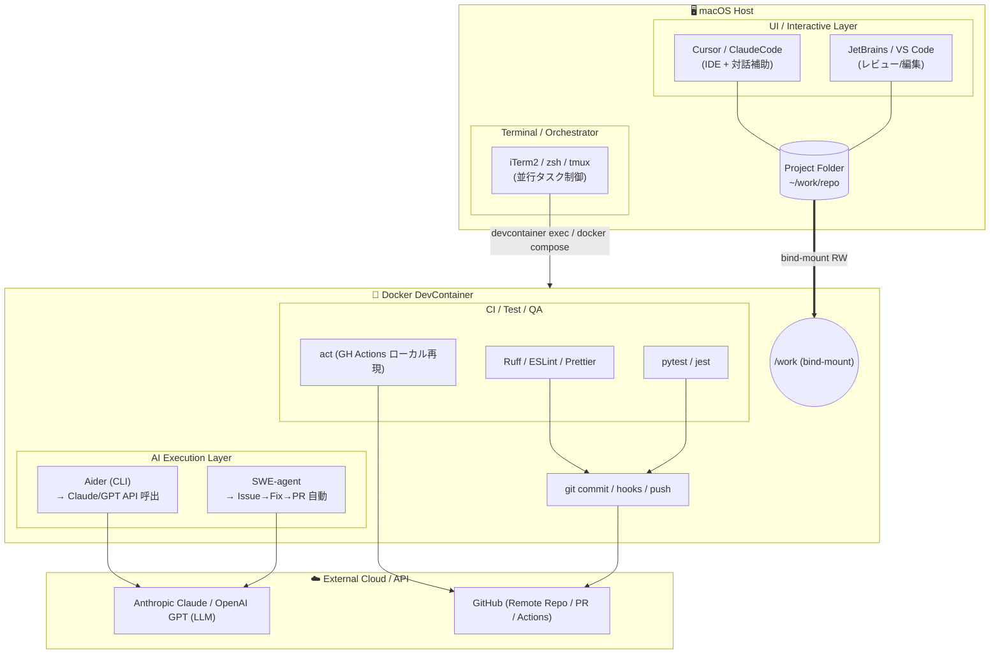
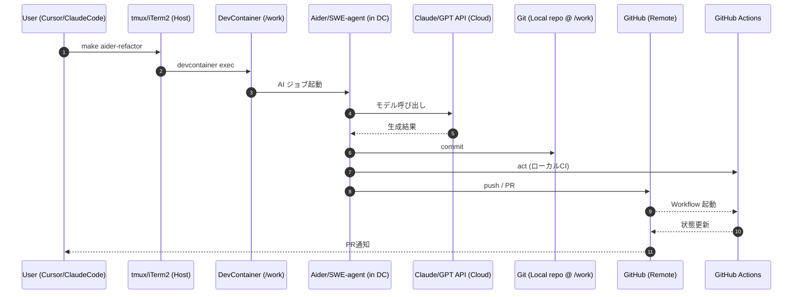
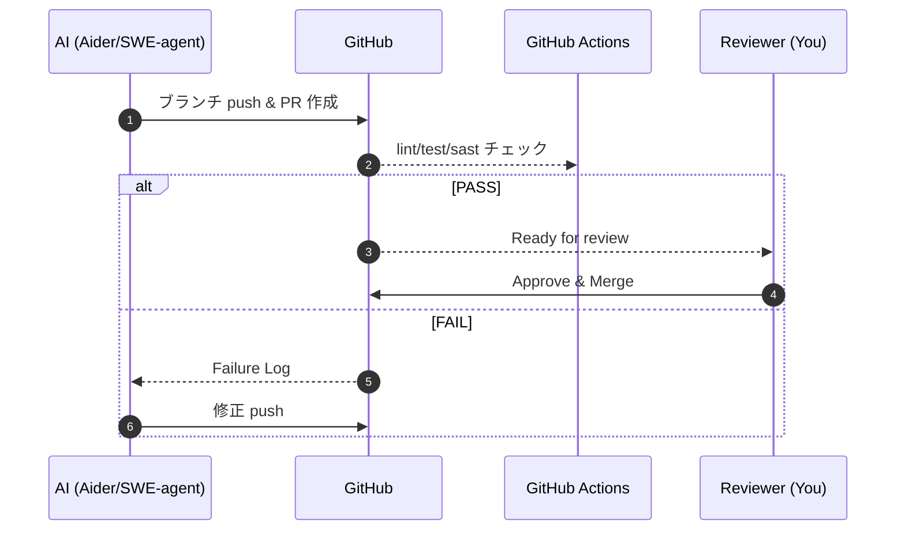
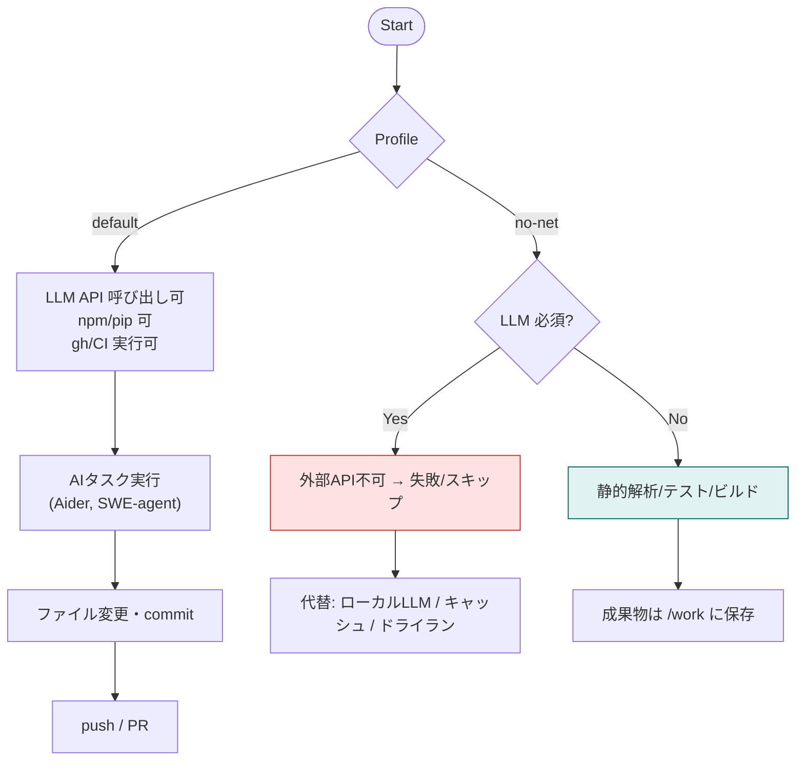

# AI Agent × DevContainer × tmux Architecture

本書は、AIエージェント（Aider/SWE-agent 等）を **DevContainer** 内で安全に実行し、ホスト側の **Cursor/ClaudeCode** を UI として活用しつつ、**tmux** で並行タスクをオーケストレーションするための構成と運用の要点をまとめたものです。

---

## 1. 全体像（System Architecture）



---

### 1.2 役割分担

| レイヤー  | 主ツール                   | 置き場所             | 主な役割                    |
| ----- | ---------------------- | ---------------- | ----------------------- |
| UI/対話 | Cursor, ClaudeCode     | **ホスト**          | 設計・レビュー・プロンプト入力         |
| 自動実行  | **Aider**, SWE-agent   | **DevContainer** | ワンショット/バッチの自動修正・コミット・PR |
| LLM   | Claude/GPT             | クラウド             | 実際の推論処理（API 呼び出し）       |
| CI/検証 | ruff/pytest/eslint/act | DevContainer     | 自動検証・事前チェック             |
| 並行実行  | **tmux**               | **ホスト（推奨）**      | 複数ペインで AI/テスト/ログを同時進行   |

---

## 2. 運用フロー（Operational Workflows）

### 2.1 基本的な運用例

```bash
make setup
make aider-plan
make aider-refactor
make ci-local
ISSUE_URL="https://github.com/you/repo/issues/123" make swe-fix
```

---

### 2.2 データフロー（Sequence Diagram）



---

## 3. PR 自動化ワークフロー

### 3.1 PR 作成から Merge までのフロー



---

### 3.2 自動化の利点

- **一貫性**: AI が統一されたコーディング規約でコード生成
- **速度**: 人手による修正待ちを削減
- **品質**: CI/CD による自動検証で早期にバグを検出
- **トレーサビリティ**: Issue → Commit → PR → Merge の履歴が明確

---

## 4. DevContainer 環境の詳細

### 4.1 Reopen in Container の効用

- **ツールチェーン統一**: Linter/Debugger/Language Server をコンテナ側に固定
- **環境一致**: ローカル開発環境と CI 環境を完全に一致させる
- **セキュリティ**: 非 root ユーザーでの実行、ネットワーク制御が可能
- **ポータビリティ**: チーム全体で同じ開発環境を共有

### 4.2 ネットワーク遮断プロファイル（no-net）



**用途例**:

- **セキュリティ強化**: 機密プロジェクトで外部 API 接続を禁止
- **オフライン作業**: ネットワーク接続がない環境でのテスト・ビルド
- **コスト削減**: LLM API を使わない静的解析のみ実行

---

## 5. Mermaid 図の活用

### 5.1 推奨 VSCode 拡張機能

- `bierner.markdown-mermaid` - Markdown プレビュー内での表示
- `vstirbu.vscode-mermaid-preview` - 専用プレビューウィンドウ
- `shd101wyy.markdown-preview-enhanced` - 高機能プレビュー

### 5.2 画像出力（CLI）

```bash
# mermaid-cli のインストール
npm i -g @mermaid-js/mermaid-cli

# PNG/SVG 出力
mmdc -i diagram.mmd -o diagram.png
mmdc -i diagram.mmd -o diagram.svg
```

---

## 6. ベストプラクティス

### 6.1 開発フロー

1. **計画**: `make aider-plan` で設計方針を AI と対話
2. **実装**: `make aider-refactor` で段階的に実装
3. **検証**: `make ci-local` でローカルテスト実行
4. **レビュー**: Cursor/ClaudeCode で差分確認
5. **統合**: PR 作成 → CI 通過 → Merge

### 6.2 セキュリティ

- **最小権限**: DevContainer は非 root で実行
- **ネットワーク制御**: no-net プロファイルで外部通信制限
- **秘密情報管理**: `.env` ファイルや環境変数を活用、コミット禁止
- **コード監査**: `act` でローカル再現して SAST/DAST を事前実行

### 6.3 並行タスク管理（tmux）

```bash
# tmux セッション作成
tmux new -s dev

# ペイン分割例
# - ペイン 1: Aider 実行
# - ペイン 2: テスト監視 (pytest --watch)
# - ペイン 3: ログ監視 (tail -f logs/*.log)
# - ペイン 4: git status 確認

# セッション一覧
tmux ls

# セッションにアタッチ
tmux attach -t dev
```

### 6.4 Aider を選択する理由と他ツールとの比較

#### Aider を選ぶ主な理由

- **ローカルリポジトリに直接操作可能**：Git 差分を自動生成・適用し、commit や branch 管理まで一貫して処理できます。
- **非対話・バッチ実行が容易**：`--message` と `--yes` オプションで、CI からワンショット指令が可能。
- **LLM 依存を柔軟に切り替え**：Claude / GPT / Gemini など複数モデルを選択可能。
- **CLI単体で完結**：エディタやUIを必要とせず、DevContainer で安全に完結。
- **git-aware AIアシスタント**：変更箇所を限定し、リポジトリの履歴に忠実な修正が得られる。

#### 代替となる代表的ツールと比較

| 項目     | **Aider**     | **SWE‑agent**  | **OpenHands (旧 OpenDevin)** | **GitHub Copilot CLI** |
| ------ | ------------- | -------------- | --------------------------- | ---------------------- |
| 実行形態   | CLI／非対話バッチ可   | CLI（Issue駆動）   | Web／CLI（重量級）                | CLI（補完寄り）              |
| 修正単位   | Git 差分単位      | Issue→修正→PR 自動 | タスク全体（シミュレーション含む）           | 1コマンド補完                |
| LLM 対応 | Claude, GPT 等 | Claude, GPT    | GPT系, Claude 等              | GPT 系のみ                |
| コンテナ適性 | ◎（軽量・依存少）     | ◎（Python環境）    | △（ブラウザ依存あり）                 | ○（Node依存）              |
| 対話操作   | 任意（非対話も可）     | 基本非対話          | 対話・マルチステップ                  | 対話寄り                   |
| PR 自動化 | △（コミットまで）     | ◎（PR作成まで自動）    | ○（手動連携）                     | ×                      |
| 再現性    | 高（明示コマンド）     | 高（明示ワークフロー）    | 中（動作幅大）                     | 中                      |
| 重量感    | 軽量            | 中量             | 重量                          | 軽量                     |

> **📝 TODO for Future Consideration**:
>
> - Add "When to use each tool" decision matrix (use-case driven selection guide)
> - Reference specific Makefile targets that use Aider (`make aider-plan`, `make aider-refactor`) in this comparison context

---

## 7. まとめ

この構成により、以下が実現されます：

- **安全性**: DevContainer による隔離環境での AI 実行
- **生産性**: tmux による複数タスクの並行実行とモニタリング
- **一貫性**: CI/CD とローカル環境の完全一致
- **柔軟性**: ホスト側の UI ツール（Cursor/ClaudeCode）との統合
- **自動化**: Issue → Fix → PR → Merge の完全自動化

### 参考リソース

- [DevContainers 公式ドキュメント](https://containers.dev/)
- [Aider 公式ドキュメント](https://aider.chat/)
- [tmux チートシート](https://tmuxcheatsheet.com/)
- [Mermaid 公式サイト](https://mermaid.js.org/)

---

**Last Updated**: 2025-10-09
