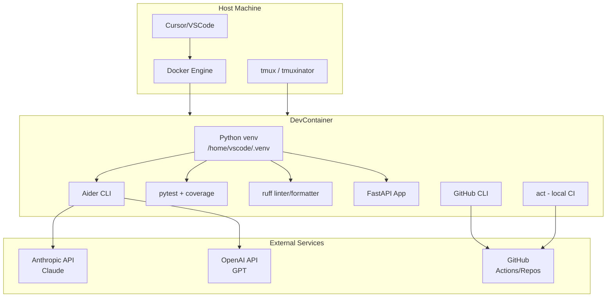
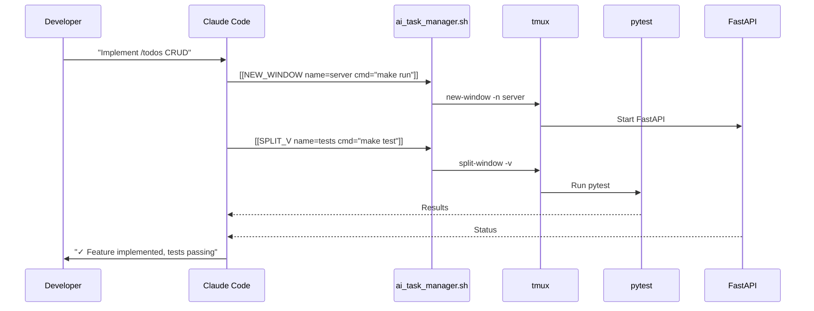

# AI Dev Template - Architecture Overview

## Design Philosophy

This template combines **proven stability** (ai_dev_test) with **comprehensive tooling** (sample/) to create a production-ready foundation for AI-driven development.

## Key Architecture Decisions

### 1. Virtual Environment Isolation ✅

**Problem:** Global pip installs cause package conflicts in DevContainers

**Solution:**
```json
"postCreateCommand": "python3 -m venv /home/vscode/.venv && ..."
"postStartCommand": "echo 'source /home/vscode/.venv/bin/activate' >> /home/vscode/.bashrc"
```

**Benefits:**
- No conflicts with system packages
- Reproducible dependencies
- Easy to reset/rebuild

### 2. Explicit Service Naming ✅

**Problem:** Generic service names (`dev`) make debugging harder

**Solution:**
```yaml
services:
  ai-dev-template:  # Specific, descriptive name
    image: container-ai-dev-template
```

**Benefits:**
- Clear container identification
- Better logs and error messages
- Multi-project management

### 3. Security-First Configuration ✅

**Implementation:**
```yaml
cap_drop:
  - ALL
security_opt:
  - no-new-privileges:true
user: vscode  # Non-root
```

**Benefits:**
- Minimal attack surface
- Principle of least privilege
- Production-ready security posture

### 4. Dual-Profile Docker Compose ✅

**Profiles:**
- `default` - Full network access (LLM APIs)
- `no-net` - Network isolation (offline testing)

**Use cases:**
- Default: Normal development with AI tools
- No-net: Security testing, offline work, CI without external deps

## Component Architecture



## Directory Structure Rationale

### Template File Naming Convention

**In the template repository:** Files use `dot.` prefix (e.g., `dot.devcontainer/`, `dot.gitignore`)
- ✅ Visible in Finder/Explorer without special settings
- ✅ Easy to browse and edit
- ✅ No accidental hiding of important config files
- ✅ Clear intent that these become hidden files after deployment

**After deployment:** The `setup_template.sh` script automatically converts `dot.*` → `.*`
- Example: `dot.devcontainer/` → `.devcontainer/`
- Example: `dot.gitignore` → `.gitignore`

### `.devcontainer/` - Container Definition
- `Dockerfile` - Base image (Ubuntu 24.04 arm64)
- `compose.yml` - Service orchestration
- `devcontainer.json` - VSCode/Cursor integration
- `health-check.sh` - Environment verification
- `tmux/tmux.conf` - Project-scoped tmux configuration

**Why separate from project root?**
- Clear separation of concerns
- Easy to update/replace
- Standard VSCode convention

**tmux Configuration Strategy:**
- **Project-scoped config** in `.devcontainer/tmux/tmux.conf`
- **Symlinked to `~/.tmux.conf`** during `postCreateCommand`
- **Benefits:**
  - ✅ Version controlled per-project
  - ✅ Shared across team via git
  - ✅ No conflicts with host tmux config
  - ✅ Automatically applied in container
  - ✅ Easy to customize for specific projects

**Symlink creation:**
```bash
# In devcontainer.json postCreateCommand:
ln -sf /work/.devcontainer/tmux/tmux.conf /home/vscode/.tmux.conf
```

### `app/` - Application Code
- Minimal FastAPI example
- Health check endpoint
- Extensible structure

**Why included?**
- Working example to validate setup
- Reference implementation
- Quick start for new projects

### `tests/` - Test Suite
- pytest configuration
- TestClient examples
- Coverage setup

**Why co-located?**
- Standard Python convention
- Easy test discovery
- Integrated with CI

### `.github/workflows/` - CI/CD
- Lint, format, test
- Security scanning
- Coverage reporting

**Why GitHub Actions?**
- Standard for open source
- Free for public repos
- Local testing via `act`

### `.vscode/` - IDE Integration
- `tasks.json` - Quick commands

**Why VSCode-specific?**
- Most popular with DevContainers
- Works with Cursor (VSCode fork)
- Easy discoverability (Cmd+Shift+P)

## Configuration Files

### `.aider.conf.yml` - AI Assistant Config
```yaml
model: claude-sonnet-4-5-20250514
auto-commits: true
dirty-commits: true
edit-format: diff
```

**Key settings:**
- Latest Claude model
- Auto-commit on success
- Diff format (clearer changes)
- Git integration

### `.tmuxinator.yml` - Session Layout
```yaml
windows:
  - dev:
      layout: tiled
      panes:
        - make run
        - make test
        - make aider-refactor
        - monitor
```

**Design:**
- 4 equal panes (tiled layout)
- Server, tests, AI, monitoring
- All running in parallel

**Works with project tmux config:**
- Custom keybindings (Ctrl-a prefix)
- Vim-style pane navigation (h/j/k/l)
- Enhanced status bar
- Mouse support

### `.pre-commit-config.yaml` - Quality Gates
```yaml
repos:
  - ruff (lint + format)
  - shellcheck
  - markdownlint
  - yamllint
  - secret detection
```

**Philosophy:**
- Catch issues before commit
- Auto-fix when possible
- Multiple language support

### `Makefile` - Task Automation
```make
.PHONY: setup run test lint format clean
       aider-plan aider-refactor ci-local health-check
```

**Benefits:**
- Consistent interface across projects
- Self-documenting (`make` lists targets)
- Easy to extend

## Workflow Patterns

### Pattern 1: Local Development Loop
```
Edit code → make lint → make test → commit
```

### Pattern 2: AI-Assisted Feature
```
make aider-plan → Review → make aider-refactor → make test → commit
```

### Pattern 3: Pre-Push Validation
```
make pre-commit-run → make ci-local → push
```

### Pattern 4: Parallel Development (tmux)
```
tmuxinator start
  Pane 1: make run (watch mode)
  Pane 2: make test (continuous)
  Pane 3: make aider-refactor
  Pane 4: gh pr status --watch
```

## Scaling Path to sample_adv Vision

### Current (Phase 1): Stable Foundation ✅
- Working DevContainer
- Manual tmux orchestration
- Human-triggered AI assistance

### Next (Phase 2): Semi-Automation
- Add `ai_task_manager.sh`
- Marker-based tmux control
- AI suggests pane layout
- Human approves execution

### Future (Phase 3): Full Autonomy
- AI reads project state
- Dynamically creates tmux sessions
- Self-organizing workflows
- Continuous feedback loops

**Example autonomous flow:**


## Extension Points

### Add New Language (e.g., Node.js)
1. Update `Dockerfile` - Add Node.js
2. Update `devcontainer.json` - Install npm packages
3. Update `Makefile` - Add npm targets
4. Update `.vscode/tasks.json` - Add Node tasks
5. Update `ci.yml` - Add Node jobs

### Add New Tool (e.g., Docker Compose for services)
1. Add to `.devcontainer/compose.yml`
2. Update `health-check.sh` - Verify tool
3. Add Makefile targets
4. Document in README.md

### Integrate sample_adv Automation
1. Copy `scripts/ai_task_manager.sh`
2. Copy `scripts/claude_run.sh`
3. Update `.tmuxinator.yml` - Add manager pane
4. Add marker support to `.aider.conf.yml`
5. Test marker-based workflow

## Performance Considerations

### Container Startup Time
- ~30-60s initial build
- ~5-10s subsequent starts
- Optimize: Cache layers, minimize packages

### venv Installation
- ~10-20s for postCreateCommand
- One-time per container rebuild
- Cached in `.cache/` mount

### tmux Session Creation
- ~2-3s for 4-pane layout
- Instant pane switching
- No performance overhead

### AI Tool Response Time
- Aider: 5-30s depending on task
- Claude Code: Variable (API dependent)
- Optimize: Use `--yes` flag, smaller prompts

## Troubleshooting Guide

### Issue: "Python module not found"
**Cause:** venv not activated
**Fix:** `source /home/vscode/.venv/bin/activate`
**Prevention:** Check postStartCommand ran

### Issue: "Permission denied"
**Cause:** Running as wrong user
**Fix:** Check `user: vscode` in compose.yml
**Prevention:** Never run as root

### Issue: "API key not found"
**Cause:** .env not loaded
**Fix:** Rebuild container, check .env syntax
**Prevention:** Verify `environment:` section in compose.yml

### Issue: "Port already in use"
**Cause:** Previous container still running
**Fix:** `docker compose down`
**Prevention:** Use unique port mappings

## Metrics & Observability

### Current Status
- ❌ No metrics collection
- ✅ Logs via stdout
- ✅ Coverage reports
- ⚠️ Manual monitoring

### Future Enhancements
- Add API usage tracking (from sample/ metrics system)
- tmux status bar integration
- Real-time cost monitoring
- Automated alerts

## Security Hardening

### Current Measures ✅
- Capability dropping
- Non-root user
- Secret detection (pre-commit)
- Security scanning (Bandit)
- .env in .gitignore

### Additional Recommendations
- Rotate API keys monthly
- Use GitHub Secrets for CI
- Enable Dependabot
- Regular security audits
- Container image scanning

## Conclusion

This architecture prioritizes:
1. **Stability** - Proven patterns first
2. **Simplicity** - Easy to understand and modify
3. **Security** - Defense in depth
4. **Extensibility** - Ready for automation
5. **Documentation** - Self-explanatory structure

The template provides a solid foundation that can grow from manual workflows to full AI autonomy while maintaining reliability and security throughout.
