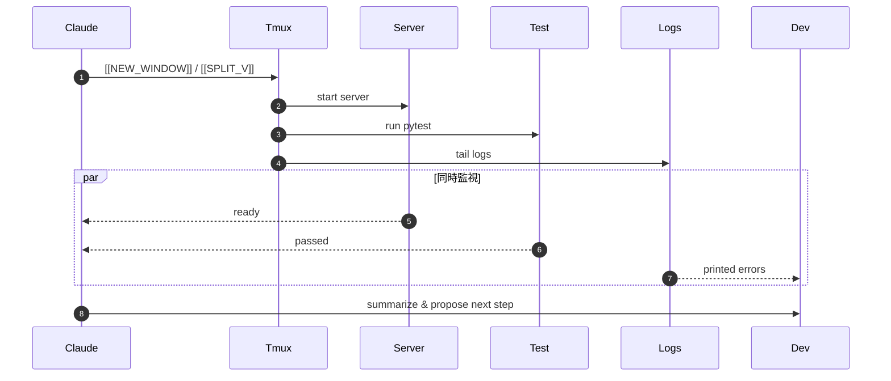

# 🧠 AI自律開発環境における tmux の役割

**tmux は「マルチスレッド」ではない。**  
それでも AI Dev において重要な理由とは？

> Claude Code × Aider × tmux による  
> 「操作的並列化（Concurrency of Tasks）」の設計意図を解説

---

## 🧩 1. tmux の本質

| 観点 | 内容 |
|------|------|
| 性質 | ターミナル多重化ツール（CPUスレッドではない） |
| 動作単位 | 各ペインは独立したシェルプロセス |
| 並列性 | OSスケジューラが複数ジョブを同時進行 |
| 効果 | **複数タスクの同時監視・操作** が可能 |

🧩 = 「物理的並列（Parallelism）」ではなく  
　　 「操作的並列（Concurrency）」を実現する

---

## ⚙️ 2. マルチスレッドとの比較

| 項目 | マルチスレッド | tmux 並列 |
|------|----------------|------------|
| 実行主体 | 同一プロセス内のスレッド | 各ペインが別プロセス |
| CPU利用 | コア単位で並列 | OSが各シェルをスケジューリング |
| 目的 | 計算性能の向上 | 操作効率・視覚的並列性 |
| 適用領域 | コード内部 | 開発環境全体 |

> tmux は「実行リソースの分割」ではなく  
> 「作業視点の分割」を提供する。

---

## 🧠 3. Claude × tmux による自律タスク分割

Claude や Aider が出力するマーカー：
```
[[NEW_WINDOW name=server cmd="uvicorn app.main:app --reload"]]
[[SPLIT_V name=tests cmd="pytest -q -k unit"]]
```

→ tmux が新しいウィンドウ／ペインを生成して  
**サーバ起動・テスト・ログ監視を同時進行**

---

## 🧩 4. 処理イメージ（Mermaid 図）

```mermaid
flowchart LR
  A[Claude / Aider] -->|出力: [[NEW_WINDOW]]| B[ai_task_manager.sh]
  B --> C[tmux]
  C -->|ウィンドウ1| D[サーバ起動]
  C -->|ウィンドウ2| E[pytest 実行]
  C -->|ウィンドウ3| F[tail -f logs]
  D & E & F --> G[開発者UI / Claudeモニタリング]
```

> 💬 AIがマーカーを発行し、tmux が物理的な「場」を編成。  
> 結果的に **人間の待機時間を削減**。

---

## ⚡️ 5. 効果の性質

| 種別 | 内容 |
|------|------|
| 🧮 処理性能 | CPUスループットは変わらない |
| ⏱ 操作効率 | コマンド再実行・タブ切替を削減 |
| 👀 視覚効果 | タスクの同時監視・即時再起動が可能 |
| 🤖 自動化 | Claudeが非同期でタスク分割・進行 |

➡ **「time-to-feedback（フィードバックまでの時間）」が短縮**

---

## 📊 6. 体感的効果のモデル

| 項目 | シリアル実行 | tmux併用 | 差分 |
|------|----------------|-----------|------|
| ビルド | 60s | 60s | - |
| テスト | 30s | 30s | - |
| ログ監視・再実行 | 40s | 0s | ▼40s |
| **合計** | **130s** | **60s** | **約50％削減** |

> CPU性能ではなく「開発サイクルの壁時計時間」を短縮。

---

## 🧭 7. 実運用での意味

- Claude / Aider が自動で tmux ペインを生成  
  → 「人が切り替える」動作を削除  
- テスト・ログ・サーバ起動を並行監視  
  → **異常検出が即座に行える**  
- AIによる「完了判定 → 次タスク起動」が可能  
  → 開発ループを**非同期連鎖化**

---

## ⚙️ 8. 開発サイクルの並行化モデル



---

## 🔍 9. 表現のまとめ方（説明文例）

> tmux による並列化は、CPUの高速化ではなく、  
> **AIと人間が複数タスクを同時進行させる“操作並列化”** の仕組み。  
> これにより「待ち時間の削減」と「開発ループの即時反応化」が得られる。

---

## ✅ 10. まとめ

| 観点 | 内容 |
|------|------|
| 技術的 | tmux は操作・観測タスクを並列化する「非同期UI層」 |
| 運用的 | Claude/Aiderが自動でタスク分割し、同時実行を誘発 |
| 効果 | **Time-to-Feedback短縮／開発スループット向上** |
| 表現例 | “自律実行型AI開発における操作的並列化の中核レイヤー” |

---

## 🧩 結論

> **tmux = AI開発パイプラインのマルチタスク・ハブ。**  
>  
> CPUを速くするのではなく、  
> **人間とAIの作業遅延を消す。**

---

