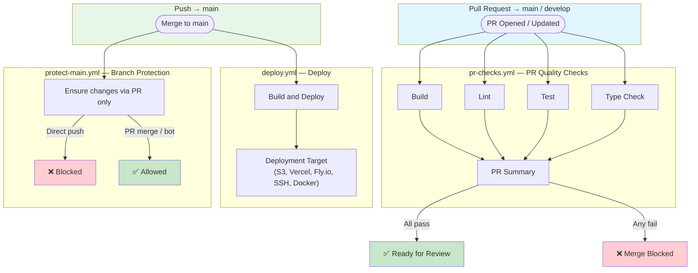

# GitHub Configuration

This directory contains GitHub Actions workflows, PR templates, and issue templates for the project.

## Contents

```
.github/
├── workflows/
│   ├── pr-checks.yml       # PR quality gates (build, lint, test, type-check)
│   ├── deploy.yml          # Build and deploy pipeline
│   └── protect-main.yml    # Branch protection enforcement
├── ISSUE_TEMPLATE/
│   ├── bug_report.yml      # Bug report form
│   ├── feature_request.yml # Feature request form
│   └── config.yml          # Issue chooser configuration
└── PULL_REQUEST_TEMPLATE.md
```

## Pipeline Overview



## Workflows

| Workflow | Trigger | Purpose |
|----------|---------|---------|
| [`pr-checks.yml`](workflows/pr-checks.yml) | PR to `main` / `develop` | Runs build, lint, test, and type-check in parallel |
| [`deploy.yml`](workflows/deploy.yml) | Push to `main` / manual | Builds and deploys to configured target |
| [`protect-main.yml`](workflows/protect-main.yml) | Push to `main` | Blocks direct pushes; only allows PR merges and bot pushes |

## Runtime Detection

All jobs auto-detect the project type by checking for `package.json`. If the file is absent, Node.js setup and commands are **skipped** (not failed), so the workflows work for any project type without modification.

```
Checkout → Detect project type → (if Node.js) Setup → Install → Run command
                                 (if not)     steps are skipped, job succeeds
```

> **TODO:** To add support for other runtimes (Python, Go, Java), extend the detection step in each job. See the inline TODO comments in the workflow files.

## Customization Checklist

- [ ] Replace `npm ci` / `npm run build` with your project's commands
- [ ] Configure lint, test, and type-check commands (or remove unused jobs)
- [ ] Choose a deployment target in `deploy.yml` (Options A–E)
- [ ] Set required secrets in GitHub repo settings
- [ ] Optionally narrow the `paths` filter in `pr-checks.yml`
